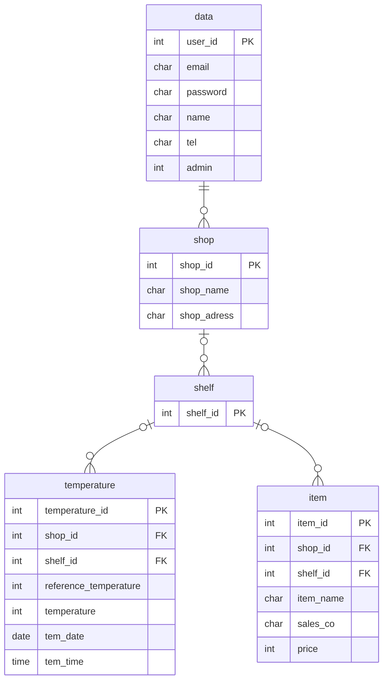

## 商品管理アプリ

このアプリは**商品**を管理します。

## ER図

## テーブルについて
data : ユーザの個人情報 
shop : 店舗情報 
shelf : 商品棚の番号情報 
temperature : 商品棚の温度情報 
item : 商品棚に置いてある商品についての情報

## API仕様書
Webサイトにアクセスした**時間**を返します

## GET /api/time
**出力例** 
{ 
　"1.year": 2023, 
　"2.month": 11, 
　"3.month_name": "November", 
　"4.day": 11, 
　"5.weekday": "Saturday", 
　"6.hour": 2, 
　"7.minute": 46, 
　"8.second": 51, 
　"9.now": "2023-11-11T02:46:51.047523" 
} 

**説明** 
year : 現在の年 
month : 現在の月 
month_name : 現在の月(英語の名称) 
day : 現在の日付 
weekday : 現在の曜日 
hour : 現在の時間(時) 
minute : 現在の時間(分) 
second : 現在の時間(秒) 
now : 現在の時間(年、月、日、時間、分、秒、マイクロ秒) 
