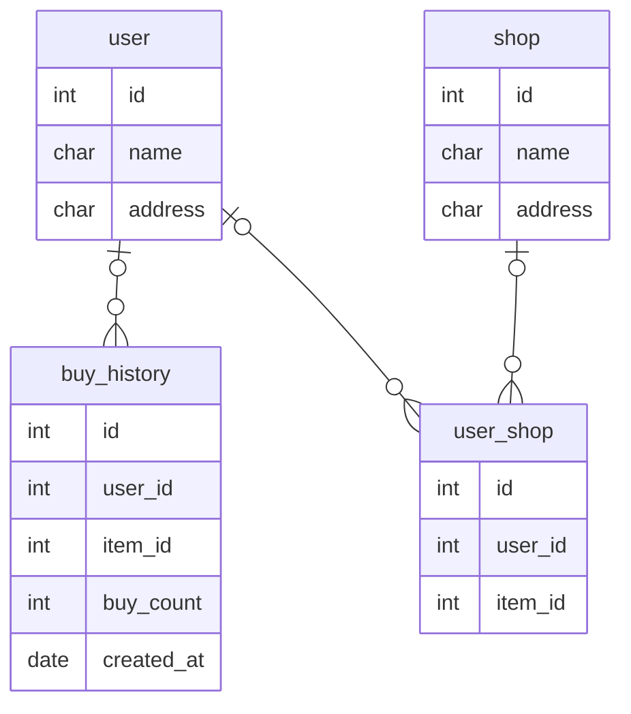

## 温度管理アプリ
このアプリは任意の場所の**温度**を管理します。

## ER図

```mermaid
erDiagram
user {
    int id
    char name
    char address
}

buy_history{
    int id
    int user_id
    int item_id
    int buy_count
    date created_at
}

shop{
    int id
    char name 
    char address
}

user_shop{
    int id
    int user_id
    int item_id
}

user |o--o{ buy_history : ""
user |o--o{ user_shop : ""
shop |o--o{ user_shop : ""
```