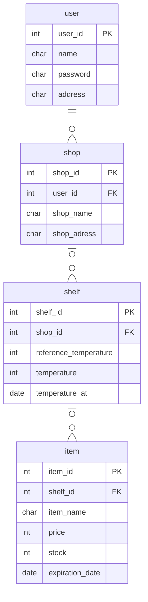

## 温度管理アプリ
このアプリは商品棚の**温度**を管理します。

## ER図

```mermaid
erDiagram
user {
    int user_id PK
    char name
    char password
    char address
}

shop {
    int shop_id PK
    int user_id FK
    char shop_name
    char shop_adress
}

shelf {
    int shelf_id PK
    int shop_id FK
    int reference_temperature
    int temperature
    date temperature_at
}

item {
    int item_id PK
    int shelf_id FK
    char item_name
    int price
    int stock
    date expiration_date
}

user ||--o{ shop : ""
shop |o--o{ shelf : ""
shelf |o--o{ item : ""
```

## テーブルについて
user : ユーザの個人情報 
shop : 店舗情報 
shelf : 商品棚の温度情報 
item : 商品棚に置いてある商品についての情報!